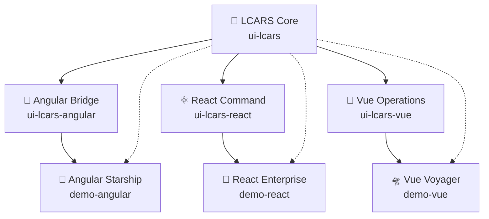

# 🖖 LCARS Web Components

[](https://www.npmjs.com/package/@starfleet-technology/lcars)
[](https://github.com/starfleet-technology/lcars-webcomponents/actions/workflows/ci.yml)
[](./LICENSE)
[](https://stenciljs.com/)


> **Library Computer Access/Retrieval System (LCARS)** — an authentic, accessible design system built with **Stencil** & **Web Components**, with first-class **Angular/React/Vue** bindings.

> *Fan project. Not affiliated with Paramount/CBS. "Star Trek", "LCARS", and related marks are trademarks of their owners.*

---

## ✨ Features

- **Framework-agnostic** Web Components with thin **Angular/React/Vue** wrappers
- **Authentic LCARS look** with theme tokens and CSS parts for customization
- **Accessible by default**: keyboard navigation, ARIA, and contrast targets
- **Tree-shakeable** components & tokens; Storybook docs + live demos

---

## ⚡ Quickstart (60 seconds)

### Vanilla / Web Components

```bash
pnpm add @starfleet-technology/lcars
```

```ts
// main.ts
import { defineCustomElements } from '@starfleet-technology/lcars/loader';
defineCustomElements();
```

```html
<!-- anywhere in your app -->
<lcars-button kind="primary">Engage</lcars-button>
```

<details>
<summary><strong>React</strong></summary>

```bash
pnpm add @starfleet-technology/lcars-react
```

```tsx
import { LcarsButton } from '@starfleet-technology/lcars-react';

export default function App() {
    return <LcarsButton kind="primary">Engage</LcarsButton>;
}
```

</details>

<details>
<summary><strong>Angular</strong></summary>

If you use the **wrapper package**:
```ts
import { LcarsModule } from '@starfleet-technology/lcars-angular';

@NgModule({ 
    imports: [LcarsModule] 
}) 
export class AppModule {}
```

If you use **Web Components directly**:
```ts
import { NgModule, CUSTOM_ELEMENTS_SCHEMA } from '@angular/core';
import { defineCustomElements } from '@starfleet-technology/lcars/loader';

defineCustomElements();

@NgModule({
    // ...
    schemas: [CUSTOM_ELEMENTS_SCHEMA]
})
export class AppModule {}
```

</details>

<details>
<summary><strong>Vue</strong></summary>

```bash
pnpm add @starfleet-technology/lcars @starfleet-technology/lcars-vue
```

If using **wrapper components**:
```vue
<template>
    <LcarsButton kind="primary">Engage</LcarsButton>
</template>

<script setup>
import { LcarsButton } from '@starfleet-technology/lcars-vue';
import { defineCustomElements } from '@starfleet-technology/lcars/loader';

// Ensure Web Components are registered
defineCustomElements();
</script>
```

If using a **plugin** (when available):
```ts
import { createApp } from 'vue';
import App from './App.vue';
import LcarsPlugin from '@starfleet-technology/lcars-vue';

createApp(App).use(LcarsPlugin).mount('#app');
```

</details>


**Explore the complete component library**: [📖 Storybook Documentation](https://starfleet-technology.github.io/lcars-webcomponents/)

### Component API Example

```html
<lcars-button 
  kind="primary" 
  size="large" 
  disabled="false"
  onclick="handleEngagement()">
  Engage
</lcars-button>
```

| Property   | Type      | Default     | Description                    |
|------------|-----------|-------------|--------------------------------|
| `kind`     | `string`  | `'default'` | Visual style variant           |
| `size`     | `string`  | `'medium'`  | Button size                    |
| `disabled` | `boolean` | `false`     | Disabled state                 |

| Event      | Detail    | Description                    |
|------------|-----------|--------------------------------|
| `lcarsClick` | `CustomEvent<{}>` | Fired when button is activated |

---

## 🧩 SSR & Bundlers

Stencil elements should be registered in the **browser** only.

```ts
import { defineCustomElements } from '@starfleet-technology/lcars/loader';

if (typeof window !== 'undefined') {
  defineCustomElements();
}
```

### SSR Framework Notes

**Next.js (App Router)**
```tsx
'use client';
import { useEffect } from 'react';
import { defineCustomElements } from '@starfleet-technology/lcars/loader';

export default function RootLayout({ children }) {
  useEffect(() => { defineCustomElements(); }, []);
  return children;
}
```

**Vite / SSG**
```ts
import { defineCustomElements } from '@starfleet-technology/lcars/loader';
if (typeof window !== 'undefined') defineCustomElements();
```

If components load assets lazily, set the asset base path:

```ts
import { setAssetPath } from '@starfleet-technology/lcars';
setAssetPath(new URL('.', import.meta.url).href);
```

*Note: `setAssetPath` is only required if components load additional assets (icons, images, etc.)*

---

## 🛸 Mission Overview

Experience the future through authentic LCARS interface components — framework-agnostic, accessible, and ready for any starship's bridge operations!

**Perfect for building:**
- 🎲 **Tabletop Companions** — RPG enhancement tools
- ⭐ **Strategy Simulators** — Fleet command experiences  
- 🚀 **Bridge Operations** — Immersive starship simulations
- 💫 **Interactive Portals** — Trek web applications
- 🎨 **Retro-futurist UIs** — Any sci-fi themed project

**Audience tiers:**
1. **Trek simulation builders** — Get authentic LCARS for your projects
2. **Open source & theming enthusiasts** — Contribute and customize
3. **General UI developers** — Access production-ready retro sci-fi components

---

## 🏗️ Monorepo Layout

| Package                       | Description                                      |
| ----------------------------- | ------------------------------------------------ |
| `packages/ui-lcars`           | Core Web Components (Stencil)                    |
| `packages/ui-lcars-angular`   | Angular bindings (generated output target)       |
| `packages/ui-lcars-react`     | React bindings                                   |
| `packages/ui-lcars-vue`       | Vue bindings                                     |
| `packages/tokens`             | Design tokens (CSS variables, JSON)              |
| `apps/storybook`              | Docs, playground, a11y checks                    |
| `apps/demo-angular`           | Angular example app                              |
| `apps/demo-react`             | React example app                                |
| `apps/demo-vue`               | Vue example app                                  |
| `config/`                     | Shared tooling configs                           |
| `tools/maintenance`           | Dependency sync & scripts                        |
| `tools/scaffolder`            | Component/package generator                      |
---

## 🧰 Requirements

* **Node**: LTS (20.x recommended)
* **pnpm**: 9.x
* **Package manager**: pnpm is required for workspace linking

---

## 🚀 Develop Locally

```bash
pnpm install
pnpm run dev           # starts Storybook and watches packages
# other scripts:
pnpm run build         # build all packages
pnpm run test          # unit/e2e tests
pnpm run lint          # eslint/stylelint
pnpm run format        # prettier
```

Storybook will open at `http://localhost:6006` (or shown in your terminal).

---

## 🎨 Theming & Tokens

All styles are driven by design tokens and CSS variables.

### Import Tokens

```css
/* src/styles.css */
@import '@starfleet/tokens/css/lcars.css';
```

```ts
// Optional: programmatic tokens
import tokens from '@starfleet/tokens/json/lcars.json';
```

### Custom Theming

```css
:root {
  --lcars-color-primary: #ff9966;
  --lcars-color-accent:  #cc66ff;
  --lcars-radius:        24px;
}
```

```html
<lcars-panel style="--lcars-color-primary:#F39C6B; --lcars-radius:32px;">
  Panel content
</lcars-panel>
```

* **CSS Parts** are exposed for fine-grained styling: `::part(chrome)`, `::part(label)`, etc.
* **Tokens** also ship as JSON for design tools and external integrations
* **Classic LCARS palettes** included with authentic color schemes

---

## ♿ Accessibility

We target **WCAG 2.2 AA** compliance with:

* ✅ **Keyboard support** for all interactive components
* ✅ **Screen reader labels** & roles (ARIA)
* ✅ **Contrast targets** meeting accessibility standards
* ✅ **Focus management** and visible indicators
* ✅ **Reduced motion** support (we respect `prefers-reduced-motion`)

See the **a11y** tab in Storybook and our automated test matrix. 
[Report accessibility issues](https://github.com/starfleet-technology/lcars-webcomponents/issues/new?template=accessibility.md) and we'll prioritize fixes.

---

## 🌐 Browser Support

| Browser        | Version |
| -------------- | ------- |
| Chrome/Edge    | last 2  |
| Firefox        | last 2  |
| Safari (macOS) | ≥ 16    |
| iOS Safari     | ≥ 16    |

*Requires Custom Elements v1 + Shadow DOM v1. No IE/Legacy Edge support. Polyfills may be required for older Safari/Android versions.*

---

## 🧪 Testing

* **Unit/E2E**: Stencil + Playwright
* **A11y**: axe & Storybook addon
* **Visual**: optional Chromatic/Playwright screenshots

---

## 🗺️ Roadmap

**Foundations:**
- Design tokens and theming system
- Classic LCARS color palettes
- Dark/light mode support

**Inputs:**
- Button, Input suite (Text, Number, Select, etc.)
- Form validation and accessibility

**Navigation:**  
- Tabs, Navigation chrome and layout components
- Breadcrumbs and menu systems

**Data Display:**
- Panel, Elbow, Pill, List, Grid
- Advanced data visualization components

**Advanced Features:**
- Internationalization (RTL, localization tokens)
- Animation & sound effects (optional)
- Custom theme builder tool

---

## 🌌 Federation Architecture



## 🤝 Contributing

We welcome PRs and issues! Please read:

* [Code of Conduct](./CODE_OF_CONDUCT.md)
* [Contributing Guide](./CONTRIBUTING.md)

**Definition of Done (per component)**

* API doc in Storybook (props/events/slots)
* A11y checks passing
* Unit/E2E tests
* Tokens + CSS parts documented
* Demos across Angular/React/Vue

All contributors welcome — developers, designers, writers, and Trek enthusiasts with bold ideas! Together we're building the future of web interfaces, one component at a time.

---

## 📄 License & Trademarks

* Code licensed under **MIT** (see [LICENSE](./LICENSE)).
* This is a **fan project** and **not affiliated** with Paramount/CBS.
  "Star Trek", "LCARS", "Starfleet", and related names are trademarks of their respective owners.
  No endorsement is implied; for educational and non-commercial purposes where applicable.

---
<div align="center">
<strong>Made with 💚 for the Star Trek community</strong><br>
<em>🖖 Live long and prosper — through code!</em>
</div>

